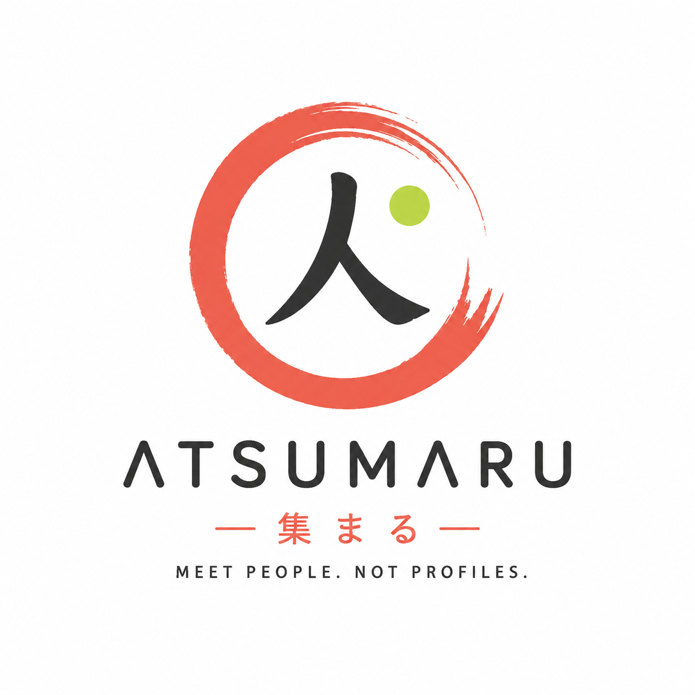
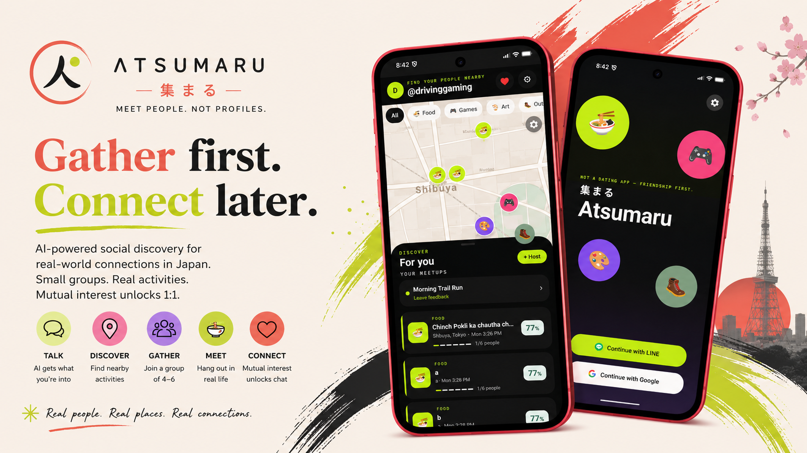
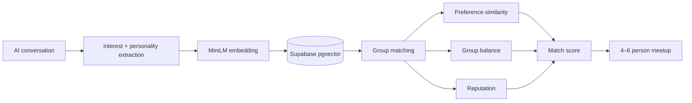
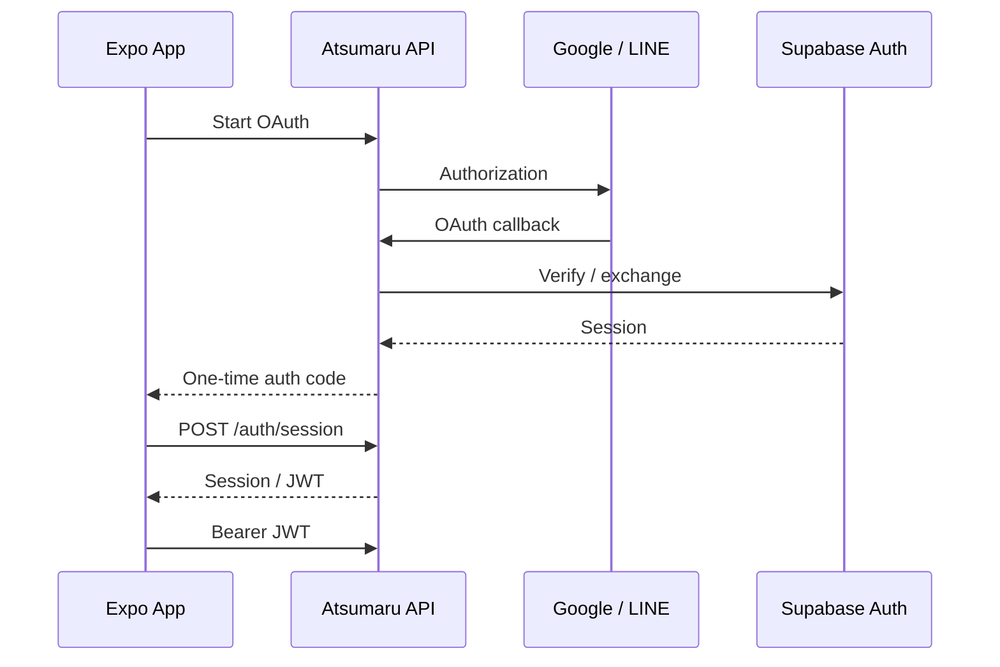

<div align="center">

#  <br>ATSUMARU

### **集まる — Meet people. Not profiles.**

<p>
  <strong>Not a dating app — friendship first.</strong>
</p>

<p>
  <em>
    AI-powered social discovery for real-world connections in Japan.
  </em>
</p>

<br>

<a href="#-the-idea">
  
</a>
<a href="#-how-it-works">
  
</a>
<a href="#-architecture">
  
</a>

<br><br>



<br>

<sub>
  <strong>Gather first.</strong> Meet in the real world. Connect only when it's mutual.
</sub>

</div>

---

<div align="center">

### ✦ THE PROBLEM

**Dating apps ask you to choose people before you've met them.**

### ATSUMARU DOES THE OPPOSITE.

**Choose something to do.  
Then meet the people who want to do it too.**

</div>

---

## ✦ The idea

**Atsumaru** (`集まる`) means:

> **to gather · to come together**

Atsumaru is a Japan-focused social discovery app built around **friendship, shared interests, and real-world experiences**.

Instead of:

```text
Swipe
  ↓
Photo
  ↓
DM
  ↓
"Want to meet?"
```

Atsumaru works like this:

```text
Interest
   ↓
Activity
   ↓
Small group
   ↓
Real-world meetup
   ↓
Private feedback
   ↓
Mutual connection
```

### The philosophy

> **Don't match people. Match moments.**

No hookup pressure.

No marriage pressure.

No unsolicited DMs.

No deciding someone's worth from six photos.

Just:

**something to do + people to do it with.**

---

## ◉ Why Atsumaru?

<table>
<tr>
<td width="33%" align="center">

### SWIPE APPS

📸

Photo-first  
1:1 matching  
Instant messaging  
Appearance-driven

</td>

<td width="34%" align="center">

### TRADITIONAL DATING

💍

High commitment  
Marriage-oriented  
Structured profiles  
Serious progression

</td>

<td width="33%" align="center">

### <strong>ATSUMARU</strong>

✦

<strong>Activity-first</strong>  
<strong>4–6 people</strong>  
<strong>Real-world meetup</strong>  
<strong>Mutual connection</strong>

</td>
</tr>
</table>

<br>

<div align="center">

### **The middle ground.**

<sub>
Not a dating marketplace. Not a marriage service.<br>
A place to gather.
</sub>

</div>

---

# ◉ How it works

<table>
<tr>
<td width="20%" align="center">

### 01

## TALK

💬

Tell the AI what you actually enjoy.

</td>

<td width="20%" align="center">

### 02

## DISCOVER

📍

Find something happening nearby.

</td>

<td width="20%" align="center">

### 03

## GATHER

👥

Join a group of 4–6.

</td>

<td width="20%" align="center">

### 04

## MEET

🍜

Actually go somewhere.

</td>

<td width="20%" align="center">

### 05

## CONNECT

✦

Mutual interest unlocks 1:1.

</td>
</tr>
</table>

---

## 01 · Talk

### AI onboarding instead of another boring questionnaire.

The conversation starts naturally:

```text
┌─────────────────────────────────────┐
│ Atsumaru AI                         │
│                                     │
│ What do you usually do on weekends? │
│                                     │
│ ─────────────────────────────────── │
│                                     │
│ I usually hike, find small cafés,   │
│ and play board games.               │
│                                     │
└─────────────────────────────────────┘
```

Atsumaru extracts useful signals:

<p>


</p>

No personality test.

No giant form.

Just conversation.

---

## 02 · Discover

### What do you actually want to do?

🍜 **Ramen night**  
🎮 **Board games**  
🥾 **Weekend hike**  
☕ **Café hopping**  
📷 **35mm photo walk**  
🎨 **Art & creative activities**

Nearby meetups appear on the discovery map.

Each event contains:

- activity
- venue
- time
- group size
- participants
- match score
- vibe

---

## 03 · Gather

### Small groups. Real people.

Every meetup is designed around:

```text
       ┌───────────┐
       │    👤     │
       │           │
  👤 ──┤   ATSU    ├── 👤
       │           │
       │    👤     │
       └───────────┘

          4–6 people
```

The matching system considers:

```text
60%  preference similarity
20%  group balance
20%  reputation
```

The objective isn't finding one perfect person.

It's creating a group where **meeting people feels natural**.

---

## 04 · Meet

The app gets out of the way.

Meet at the café.

Grab ramen.

Play games.

Go hiking.

Take photos.

Talk to strangers who already have something in common.

### The important part happens offline.

---

# ✦ 05 · Connect

## Connection comes after the meetup.

This is one of Atsumaru's most important principles.

After the event:

```text
WHO WOULD YOU LIKE TO STAY CONNECTED WITH?

○  @haru
●  @kenji
○  @yuki
```

But selecting someone does **not** immediately open a DM.

Both people must choose each other.

```text
        YOU                         KENJI

         ♥ ───────────────────────→ ♥

         ←──────────────────────── ♥


              ✦ MUTUAL ✦

              CHAT UNLOCKED
```

### No unsolicited DMs.

### No public rejection.

### No pressure.

Only mutual interest unlocks private conversation.

---

# 🧠 AI that actually gets the vibe

Atsumaru's AI isn't just a chatbot.

It feeds the matching system.



### The learning loop

After every meetup:

```text
🔥 FIRE
   ↓
"I liked this kind of person."
   ↓
Preference vector moves closer


😐 MEH
   ↓
"Probably not my vibe."
   ↓
Preference vector moves away
```

Over time:

> **Atsumaru learns who you actually enjoy spending time with.**

---

# ✦ Match intelligence

A meetup isn't just:

> "Here are four random people."

It's:

### **91% GROUP FIT**

```text
██████████████████░░  91%

🍜 Shared food interests
🎮 Gaming overlap
☕ Similar social energy
```

The score combines:

```text
match_score =
    0.6 × cosine similarity
  + 0.2 × group balance
  + 0.2 × reputation
```

---

# ◌ Built around trust

Atsumaru deliberately removes some of the mechanics that make conventional dating apps uncomfortable.

<table>
<tr>
<td align="center">

## 4–6

<strong>Small groups</strong>

Less pressure than a solo first date.

</td>

<td align="center">

## @handle

<strong>Pseudonymous identity</strong>

Real names stay private.

</td>

<td align="center">

## ↔

<strong>Mutual only</strong>

1:1 chat requires both people.

</td>

<td align="center">

## 🔒

<strong>Private feedback</strong>

Feedback isn't publicly displayed.

</td>
</tr>
</table>

---

# 🇯🇵 Designed for Japan

### 集まる

Atsumaru isn't trying to make a Japanese version of a swipe app.

The experience is designed around:

**group harmony · indirect connection · shared activities · privacy · low-pressure socializing**

The product supports:

<div align="center">

### 日本語 · English · 中文

</div>

This also opens the experience to international residents and workers living in Japan.

---

# ◉ What people can gather around

<div align="center">

<table>
<tr>
<td align="center">

### 🍜
## FOOD

Ramen  
Street food  
Cafés

</td>

<td align="center">

### 🎮
## GAMING

Arcades  
Board games  
Smash Bros

</td>

<td align="center">

### 🥾
## OUTDOORS

Hiking  
Walks  
Photo trips

</td>
</tr>

<tr>
<td align="center">

### 📷
## ARTS

Photography  
Art  
Creative workshops

</td>

<td align="center">

### ☕
## CAFÉS

Coffee  
Tea  
Vinyl

</td>

<td align="center">

### ✦
## MORE

Anything people  
can gather around.

</td>
</tr>
</table>

</div>

---

# 🏗 Architecture

```text
                         ATSUMARU
                             │
                             ▼
                  ┌───────────────────┐
                  │ React Native +    │
                  │ Expo              │
                  └─────────┬─────────┘
                            │
                   REST + Socket.io
                            │
                            ▼
                  ┌───────────────────┐
                  │ Node + Express    │
                  │ TypeScript        │
                  │ Socket.io         │
                  └───────┬─────┬─────┘
                          │     │
             ┌────────────┘     └────────────┐
             ▼                               ▼
      ┌──────────────┐                ┌──────────────┐
      │   Supabase   │                │    Groq      │
      │              │                │              │
      │ PostgreSQL   │                │ Llama 3.3    │
      │ PostGIS      │                │              │
      │ pgvector     │                └──────────────┘
      └──────┬───────┘
             │
             ▼
       MiniLM embeddings

             +
             
      ┌─────────────────┐
      │ Upstash Redis   │
      │      +          │
      │     BullMQ      │
      └─────────────────┘
```

---

# ⚙️ Tech stack

<table>
<tr>
<td>

### 📱 Mobile

- React Native
- Expo
- TypeScript
- Zustand
- React Query
- Expo SecureStore
- Expo Notifications
- i18next
- Mapbox

</td>

<td>

### 🖥 Backend

- Node.js
- Express
- TypeScript
- Socket.io
- BullMQ

</td>

<td>

### 🧠 AI / Data

- Groq
- Llama 3.3
- Hugging Face
- MiniLM
- PostgreSQL
- PostGIS
- pgvector

</td>
</tr>
</table>

---

# 📁 Repository

```text
.
├── apps/
│   └── mobile/
│       └── React Native + Expo
│
├── server/
│   ├── db/
│   │   └── schema.sql
│   └── Node + Express + Socket.io
│
├── docs/
│   ├── PRD.md
│   ├── DESIGN.md
│   ├── TRD.md
│   ├── RULES.md
│   ├── API_STRUCTURE.md
│   └── AI.md
│
└── TRACKER.md
```

---

# 🚀 Getting started

## 1. Install

```bash
npm run setup
```

Create environment files:

```bash
cp server/.env.example server/.env
cp apps/mobile/.env.example apps/mobile/.env
```

Fill in:

- Supabase
- Groq
- Hugging Face
- Google OAuth
- LINE OAuth
- Mapbox
- Redis (optional)

> ⚠️ `apps/mobile/.env` must contain **only** `EXPO_PUBLIC_*` values.
>
> These values ship inside the application bundle.

---

## 2. Database

Open your Supabase SQL editor and run:

```text
server/db/schema.sql
```

The schema is safe to reapply after pulling changes.

---

## 3. Seed demo data

```bash
npm run seed
```

Creates:

```text
6 demo users
4 Shibuya meetups
chat history
```

Generate demo access tokens:

```bash
npm run seed -- --tokens
```

Reset:

```bash
npm run seed -- --reset
```

---

## 4. Run

### API

```bash
npm run server      # API on http://localhost:4000/api  (health: /health)
npm run mobile      # Expo dev server
npm test            # server unit tests
npm run typecheck   # both packages
```

## Current state

Working: the full documented API against Supabase — OAuth sign-in for LINE and Google,
users, onboarding chat + handle suggestion/availability + profile completion (with
embedding), events (nearby/detail/create/mine/join/leave/members/match-preview), group
chat, private feedback with reputation + preference-vector learning and mutual-only
connection unlock, the post-meetup vibe recap (`GET /events/:id/recap` — a Groq one-liner
from your own ratings, cached per member, with a deterministic template fallback), DMs,
and Socket.io rooms (`group:{event_id}`, `dm:{connection_id}`,
`user:{user_id}`) that check membership and persist before broadcast. A post-meetup
sweep closes meetups out, sends the Expo feedback reminder ~1h after `start_time`, and
docks reputation from members who never submit feedback. The mobile shell is complete
(navigation, API client, socket service, i18n JP/EN/ZH, theme, Login → AI chat →
profile confirm → Discover → Meetup → feedback).

### Authentication

`GET /api/auth/line` and `GET /api/auth/google` start a login; both end at
`GET /api/auth/callback`, which mints a Supabase session. Add `?redirect_to=app` to come
back through `atsumaru://auth?code=…`; the app posts that one-time code to
`POST /api/auth/session` — tokens never travel in a URL.

The two providers differ underneath:

- **Google** is brokered by Supabase Auth. Its client id/secret live in the Supabase
  dashboard (Auth → Providers → Google), the Google console's redirect URI is Supabase's
  `https://<ref>.supabase.co/auth/v1/callback`, and the API drives PKCE so Supabase hands
  back a code rather than tokens in a fragment. `OAUTH_CALLBACK_URL` must therefore also
  be listed under Supabase → Auth → URL Configuration → **Redirect URLs**, or GoTrue
  quietly redirects to Site URL instead.
- **LINE** has no Supabase provider, so the API exchanges the code and verifies the
  `id_token` itself; its console lists `OAUTH_CALLBACK_URL`. A channel without email
  permission yields no address, so an internal synthetic one is used. When a provider does
  return an address that already has an account, the identity is linked to it rather than
  creating a second account.

On an Android emulator use `OAUTH_CALLBACK_URL=http://10.0.2.2:4000/api/auth/callback`
and point `APP_AUTH_REDIRECT` at the Expo Go origin the bundle is served from
(`exp://10.0.2.2:8081/--/auth`); `atsumaru://auth` needs a dev build.

### Background work

The sweep runs through BullMQ when `REDIS_URL` is set (Upstash's free `rediss://` URL
works) and on a five-minute in-process timer otherwise. Both drivers run the same code;
if Redis is unreachable the API logs it and falls back to the timer.

Not wired yet:

- Mobile login screen still shows a "not wired" alert; the OAuth endpoints above are ready for it
- Mobile DM/connections screens, push-token registration, create-event UI, and settings
- Real Mapbox rendering (needs a token and a native dev build)

Two endpoints go beyond `docs/API_STRUCTURE.md`, both needed by the documented flows:
`POST /api/auth/session` (deep-link handoff) and `POST /api/users/me/push-token`
(device registration for the feedback reminder).

Data routes answer `503 DB_UNAVAILABLE` until `server/.env` has Supabase keys,
onboarding chat answers `503 AI_UNAVAILABLE` without `GROQ_API_KEY`, and login answers
`503 AUTH_PROVIDER_UNAVAILABLE` without that provider's credentials. The vibe recap is the
exception: with no `GROQ_API_KEY` it returns a template line rather than an error, because
nobody is waiting on it and an empty card reads as a bug.

The map renders a placeholder until `EXPO_PUBLIC_MAPBOX_TOKEN` is set **and** the app
runs in a dev build — `@rnmapbox/maps` needs native code and does not work in Expo Go.
npm run server
```

```text
http://localhost:4000/api
```

Health:

```text
http://localhost:4000/health
```

### Mobile

```bash
npm run mobile
```

### Tests

```bash
npm test
```

### TypeScript

```bash
npm run typecheck
```

---

# 🔐 Authentication

Atsumaru uses:

```text
Google + LINE OAuth
```

No phone OTP.



Tokens are stored securely using Expo SecureStore.

---

# 🔌 Real-time

Socket.io powers:

```text
group:{event_id}
dm:{connection_id}
user:{user_id}
```

Supported events:

```text
group:join
group:message
dm:join
dm:message
typing
match:unlocked
member:joined
```

Messages are persisted before broadcast.

Membership is checked before communication is allowed.

---

# 🔔 Background work

A post-meetup sweep handles:

```text
Meetup completed
       ↓
Feedback reminder
       ↓
~1 hour after meetup
       ↓
Feedback submitted?
   ↙           ↘
 YES            NO
 ↓              ↓
Learn          Reputation
               decreases
```

With Redis:

```text
BullMQ → Upstash Redis
```

Without Redis:

```text
Five-minute in-process fallback timer
```

If Redis becomes unreachable, the API falls back automatically.

---

# 📊 Current status

<div align="center">

| Area | Status |
|---|:---:|
| Supabase API | ✅ |
| Google OAuth | ✅ |
| LINE OAuth | ✅ |
| Session handoff | ✅ |
| AI onboarding | ✅ |
| Handle generation | ✅ |
| Profile completion | ✅ |
| Embeddings | ✅ |
| Nearby events | ✅ |
| Group matching | ✅ |
| Group chat | ✅ |
| Feedback | ✅ |
| Reputation | ✅ |
| Preference learning | ✅ |
| Mutual connections | ✅ |
| 1:1 DMs | ✅ |
| Socket.io | ✅ |
| Background sweep | ✅ |
| JP / EN / ZH | ✅ |
| Mobile navigation | ✅ |
| Mobile OAuth UI | 🚧 |
| Connections UI | 🚧 |
| Push registration | 🚧 |
| Create-event UI | 🚧 |
| Real Mapbox | 🚧 |
| Settings | 🚧 |

</div>

---

# 📚 Documentation

| Document | Description |
|---|---|
| [`PRD.md`](./docs/PRD.md) | Product requirements |
| [`DESIGN.md`](./docs/DESIGN.md) | Design system & UX |
| [`TRD.md`](./docs/TRD.md) | Technical requirements |
| [`RULES.md`](./docs/RULES.md) | Engineering rules |
| [`API_STRUCTURE.md`](./docs/API_STRUCTURE.md) | API contract |
| [`AI.md`](./docs/AI.md) | AI & matching architecture |
| [`TRACKER.md`](./TRACKER.md) | Build status |

---

# ✦ Design philosophy

<div align="center">

## Don't match people.

# Match moments.

<br>

**Find something worth doing.**

↓

**Find people to do it with.**

↓

**See what happens.**

</div>

---

# 🌏 The vision

Atsumaru isn't trying to keep people inside an app.

It's trying to **get them out of it.**

The technology handles:

**discovery → compatibility → coordination → trust → consent**

Then it gets out of the way.

The best outcome isn't:

> "Someone spent two hours scrolling Atsumaru."

It's:

> **"I met five people tonight, and I'm glad I went."**

---

<div align="center">

# 集まる

### **Find something worth doing.**
### **Find people to do it with.**
### **See what happens.**

<br>


<br><br>

<strong>Meet people. Not profiles.</strong>

<br><br>

<sub>
Built for the Appathon · Atsumaru Team
</sub>

</div>
