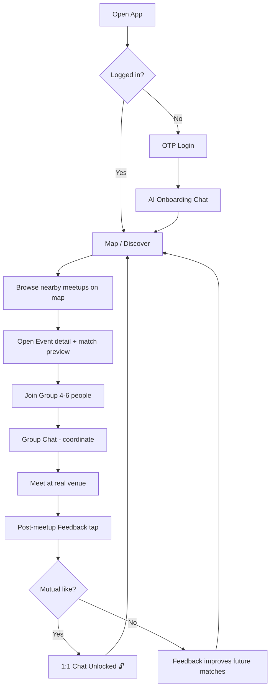
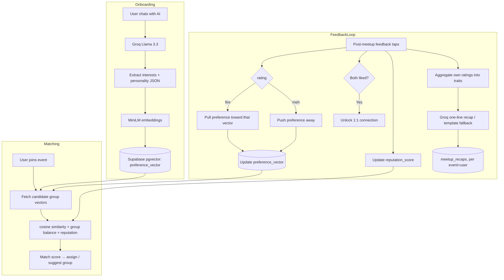

# Atsumaru — API Structure & Integration Guide

> For the **frontend engineer**: this is the backend contract to build the UI against.
> Base URL (dev): `http://localhost:4000/api` · Prod: `https://<render-app>.onrender.com/api`
> Auth: **Bearer JWT** in `Authorization` header (obtained via Supabase OAuth — **LINE** or **Google**).
> All request/response bodies are JSON. Timestamps are ISO-8601 UTC.

---

## 1. Conventions

- **Auth header:** `Authorization: Bearer <access_token>`
- **Success:** `{ "success": true, "data": { ... } }`
- **Error:** `{ "success": false, "error": { "code": "STRING", "message": "..." } }`
- **Pagination:** `?page=1&limit=20` → response includes `{ ..., "page", "limit", "total" }`
- **Geo:** coordinates are `{ "lat": number, "lng": number }`

---

## 2. Data Models (what the frontend receives)

```ts
// User
{
  id: string
  handle: string                 // @unique public handle, e.g. "trailbrew"
  display_name: string           // public, e.g. "Yuki 🏔️"
  real_name: string | null       // PRIVATE — never returned in other users' responses
  avatar_url: string | null
  language: "ja" | "en" | "zh"   // preferred UI language
  interests: string[]            // e.g. ["hiking", "coffee", "board games"]
  personality: string[]          // e.g. ["chill", "explorer"]
  reputation_score: number       // 0-100
  location: { lat: number, lng: number } | null
  created_at: string
}

// Event (a meetup)
{
  id: string
  host_id: string
  title: string
  category: string               // "outdoor" | "food" | "gaming" | "arts" | ...
  description: string
  venue_name: string
  location: { lat: number, lng: number }
  start_time: string
  max_size: number               // 4-6
  current_size: number
  status: "open" | "full" | "ongoing" | "completed"
}

// Group member (a user inside an event's group)
{
  id: string
  event_id: string
  user_id: string
  user: User                     // expanded
  joined_at: string
}

// Chat message
{
  id: string
  event_id: string               // group chat is per-event
  sender_id: string
  message: string
  created_at: string
}

// Feedback (per person, after a meetup)
{
  id: string
  event_id: string
  from_user: string
  to_user: string
  rating: "meh" | "good" | "fire"
  created_at: string
}

// Connection (unlocked 1:1)
{
  id: string
  event_id: string
  user_a: string
  user_b: string
  mutual: boolean
  unlocked_at: string | null
}
```

---

## 3. REST Endpoints

### 3.1 Auth (OAuth — LINE + Google; plus email/password. No phone OTP)
| Method | Path | Body | Returns |
|--------|------|------|---------|
| GET | `/auth/line` | — | Redirect to LINE OAuth (Supabase Custom OIDC) |
| GET | `/auth/google` | — | Redirect to Google OAuth (Supabase native) |
| GET | `/auth/callback` | `?code&provider` | `{ access_token, user, is_new }` |
| POST | `/auth/session` | `{ code, turnstile_token? }` | `{ access_token, refresh_token, user, is_new }` (single handoff-code exchange; see README) |
| POST | `/auth/logout` | — | `{ success }` |
| GET | `/auth/me` | — | `{ user }` (current session) |
| POST | `/auth/signup` | `{ email, password, turnstile_token? }` | `{ sent }` (email confirmation required; no tokens) |
| POST | `/auth/login` | `{ email, password }` | `{ code }` (single-use handoff code → redeem via `/auth/session`) |
| POST | `/auth/password/reset` | `{ email, turnstile_token? }` | `{ sent }` (anti-enumeration) |
| POST | `/auth/password/reset-complete` | `{ token_hash, password }` | `{ done }` (from the recovery-link deep link) |

> **No phone OTP** — SMS needs a paid provider (Twilio/Vonage), so we use OAuth + email/password only.
> On the client, use Supabase's `signInWithOAuth({ provider: 'line' \| 'google' })` with an Expo
> redirect URL. `is_new: true` → route the user into the AI onboarding chat.
> Email/password signup and password-reset are gated on Cloudflare Turnstile (fail-closed when
> no `TURNSTILE_SECRET_KEY` is set — `503 CAPTCHA_REQUIRED`). Confirmation and recovery emails
> redirect to `APP_AUTH_REDIRECT` (`atsumaru://auth`); recovery appends `?action=recovery`, and
> the app trades the link's `token_hash` at `/auth/password/reset-complete`.

### 3.2 Onboarding (AI chat)
| Method | Path | Body | Returns |
|--------|------|------|---------|
| POST | `/onboarding/chat` | `{ messages: [{role, content}], language? }` | `{ reply, done, extracted? }` |
| GET | `/onboarding/suggest-handles` | `?interests=hiking,coffee` | `{ handles: string[] }` |
| GET | `/onboarding/check-handle` | `?handle=trailbrew` | `{ available: boolean }` |
| POST | `/onboarding/complete` | `{ handle, display_name, language, interests[], personality[] }` | `{ user }` |

> Multi-turn chat: the AI auto-detects and replies in the user's language (`ja` / `en` / `zh`).
> When `done: true`, `extracted` = `{ interests[], personality[] }`.
> `suggest-handles` returns AI-generated `@handle` ideas from interests; validate the chosen one with `check-handle`.
> `complete` saves the profile, builds the preference vector, and needs a unique `handle`.

### 3.3 Profile
| Method | Path | Body | Returns |
|--------|------|------|---------|
| GET | `/users/me` | — | `{ user }` |
| PATCH | `/users/me` | `{ display_name?, avatar_url?, interests?, language?, location? }` | `{ user }` |
| GET | `/users/:id` | — | `{ user }` (public profile) |

### 3.4 Events (discovery)
| Method | Path | Query / Body | Returns |
|--------|------|------|---------|
| GET | `/events/nearby` | `?lat&lng&radius=5000&category?` | `{ events[] }` — for map pins |
| GET | `/events/:id` | — | `{ event, members[] }` |
| POST | `/events` | `{ title, category, venue_name, location, start_time, max_size }` | `{ event }` |
| GET | `/events/mine` | — | `{ events[] }` — joined + hosted |

### 3.5 Join & Groups
| Method | Path | Body | Returns |
|--------|------|------|---------|
| POST | `/events/:id/join` | — | `{ status: "joined" \| "matched", group_id }` |
| POST | `/events/:id/leave` | — | `{ success }` |
| GET | `/events/:id/members` | — | `{ members[] }` |
| GET | `/events/:id/match-preview` | — | `{ match_score, why: string[] }` — why this group fits |

### 3.6 Group Chat (REST fallback; realtime via Socket.io §4)
| Method | Path | Query / Body | Returns |
|--------|------|------|---------|
| GET | `/events/:id/messages` | `?page&limit` | `{ messages[] }` |
| POST | `/events/:id/messages` | `{ message }` | `{ message }` |

### 3.7 Feedback (post-meetup)
| Method | Path | Body | Returns |
|--------|------|------|---------|
| GET | `/events/:id/feedback-form` | — | `{ members[] }` — who to rate |
| POST | `/events/:id/feedback` | `{ ratings: [{to_user, rating}], rejoin: bool }` | `{ success, connections_unlocked[] }` |

> Submitting feedback updates reputation + your preference vector, and returns any **mutual matches** unlocked.

### 3.7a Vibe recap (post-meetup)
| Method | Path | Body | Returns |
|--------|------|------|---------|
| GET | `/events/:id/recap` | — | `{ recap, traits[], source, created_at }` |

> One AI-written line about the kind of people **you** clicked with, from your own ratings
> only (`docs/AI.md` §6a). Cached per member per meetup, so it never changes once written.
> `source` is `"ai"` or `"template"` — Groq wrote it, or the deterministic fallback did.
>
> `409 MEETUP_NOT_FINISHED` before the meetup ends; `404 NO_FEEDBACK_YET` until you have
> submitted your own feedback. Two members of one meetup get different recaps, and neither
> reveals the other's picks (`docs/RULES.md` §8).

### 3.8 Connections (unlocked 1:1)
| Method | Path | Body | Returns |
|--------|------|------|---------|
| GET | `/connections` | — | `{ connections[] }` — your 1:1 unlocks |
| GET | `/connections/:id/messages` | `?page&limit` | `{ messages[] }` |
| POST | `/connections/:id/messages` | `{ message }` | `{ message }` |

---

## 4. Real-Time (Socket.io)

Connect: `io(WS_URL, { auth: { token } })`

**Client → Server (emit):**
| Event | Payload | Purpose |
|-------|---------|---------|
| `group:join` | `{ event_id }` | Join a group chat room |
| `group:message` | `{ event_id, message }` | Send group message |
| `dm:join` | `{ connection_id }` | Join a 1:1 room |
| `dm:message` | `{ connection_id, message }` | Send 1:1 message |
| `typing` | `{ room_id }` | Typing indicator |

**Server → Client (listen):**
| Event | Payload | Purpose |
|-------|---------|---------|
| `group:message` | `Message` | New group message |
| `dm:message` | `Message` | New 1:1 message |
| `member:joined` | `{ event_id, user }` | Someone joined the group |
| `match:unlocked` | `Connection` | A 1:1 chat just unlocked 🎉 |
| `typing` | `{ room_id, user_id }` | Someone is typing |

---

## 5. Screen → API Map (for the frontend engineer)

| Screen | Uses |
|--------|------|
| **Login / OTP** | `/auth/request-otp`, `/auth/verify-otp` |
| **AI Onboarding chat** | `/onboarding/chat`, `/onboarding/complete` |
| **Map / Discover** | `/events/nearby` (Mapbox pins) |
| **Event detail** | `/events/:id`, `/events/:id/match-preview` |
| **Join → Group** | `/events/:id/join`, `/events/:id/members` |
| **Group chat** | Socket.io `group:*` + `/events/:id/messages` |
| **Post-meetup feedback** | `/events/:id/feedback-form`, `/events/:id/feedback`, `/events/:id/recap` |
| **Matches (1:1)** | `/connections`, Socket.io `dm:*` |
| **Profile** | `/users/me` |

---

## 6. App Flow Diagram



---

## 7. ML / AI Flow Diagram



**Scoring formula:**
```
match_score = 0.6 * cosine(user_preference, candidate_vector)
            + 0.2 * group_balance(size, ratio)
            + 0.2 * normalized_reputation

preference_update:
  new = old + lr * liked_vector - lr * disliked_vector   // lr ≈ 0.1
```

---

## 8. Notes for Frontend Engineer

- **Auth token** persists in secure storage (Expo SecureStore); attach to every request + Socket.io handshake.
- **Onboarding** is a chat UI — render `messages[]`, loop until `done: true`, then show a confirm screen for extracted interests.
- **Map** uses `@rnmapbox/maps`; feed pins from `/events/nearby`. Refresh on region change.
- **Feedback** is triggered by an Expo push notification ~1hr after `start_time`; deep-link to the feedback screen.
- **`match:unlocked`** socket event → show a celebration toast + route to the new 1:1 chat.
- **i18n:** use `i18next` + `react-i18next` with locale files `en.json`, `ja.json`, `zh.json`. Default from device locale, overridable in settings; send chosen `language` to the backend so the AI replies in it.
- **Identity:** never render `real_name`; show `@handle` + `display_name` everywhere. Use `suggest-handles` for a fun onboarding step.
- All list endpoints are paginated; implement infinite scroll where relevant.

